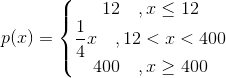

# BotBlume - Arduino 

Basically, this small program measures the state of an attached soil sensor
and reports it to a connected MQTT - Broker. 

You can also _ping_ your arduino via an MQTT - Message to force a measurement. 

## Used Hardware

### µC

I only used a _poor mans arduino_ (aka _NodeMCU v2_) which a fried gifted
me. This however **should** not make a difference when deploying this
application. 

### Soil Sensor

The soil sensor which I used for this project is an analoge one. This 
means that the measurement is indicated by a given voltage drop at the 
sense pin. (This is **not** one of those fancy sensors from amazon which 
usually have an ADC build in).

Because of this, make sure that your sensor is also an analogue one. Also,
make sure to connect the sensor to the analogue input `A1`. 

_(Maybe I will add some fancy graphics in the future)._

## Getting Started

To run this program, you have to set up a few thing. 

1. **Install the dependencies**: Since I build this with platform.io, all needed dependencies need to be installed.
    This project uses the following external libraries: 
    * PubSubClient

2. **Configure**: There is not that much which you really _have to_ configure to get started. 
Since I haven't got time to actually implement a proper way to store your user settings, you need to
edit the source code before flashing it onto your µC. (Luckily, all these settings can be configured in the _main.cpp_ file :))

The following settings need your attention to get started: 
    * `ssid`: Set this to the SSID of your access point.
    * `password`: Insert the password of your access point here.
    * `mqttIp`: This is the IP - Address of your MQTT - Broker.
    * `mqttPort`: This is the port on which your MQTT - Broker runs on.  

You can also change some more settings. There are described in the _Configuration_ section of this readme. 

3. **Flash to your Arduino (or whatever you are using)**

## Measurement

The values are aggregated to have better _understanding_, how wet the plant's
ground currently is. 

Since my sensor is analoge only, I needed to use the arduino's internal
ADC to get my measurement. Because I wanted to have the measured data in a
more _relatable_ form, I added a small function which represents the
data as a _percentage value_. A value of 100 therefore means, that the
earth is wet enough for my plant, whereas a value of 0 means, that the 
ground is completely dry. 

The formula is pretty simple and looks like this: 



_Keep in mind that I grabbed the constants out of thin air. You might want
to change these to more reasonable values._

If you want to change these values, you can currently only do it by editing
the _water_level_measure.h_ file.

The constants you can adjust are the following ones:

* `CLAMP_LEFT_VALUE`: Contains the _lower clamped_ value.
* `CLAMP_RIGHT_VALUE`: Contains the _upper clamped_ value.

## MQTT Messages

If the state of a connected soil sensor gets measured, an MQTT - Message is 
send to the connected MQTT - Broker. By default, the message is send to 
the `/blume/1/status` topic. 

The message contains the following information: 
* The aggregated value
* The raw measured value, returned by the ADC
* A flag which is set, if the measurement was forced by the user.

Each information is delimited by a semicolon (`;`). This leads to the 
following message: 

```
aggregatedValue;rawValue;forcedMeasurement
```

### Force a measurement

If you want to force a measurement, you need to publish a message
to the `blume/1/wasserstand` - Topic. _The content of this message
is ignored._

## Configuration

You can also change some _settings_ by modifying the symbolic constants in
the `main.cpp` - File. 

The following settings can be changed: 

* `POLL_DELAY`: Delay between each poll to new mqtt - messages.
* `STATE_DELAY`: Number of Milliseconds which should be waited, before measure the grounds moisture and sends the state to the connected MQTT - Broker.
* `TOPIC`: Name of the topic where the measurements should be published.
* `SUB_TOPIC`: Name of the topic which can be used to trigger a measurement.
